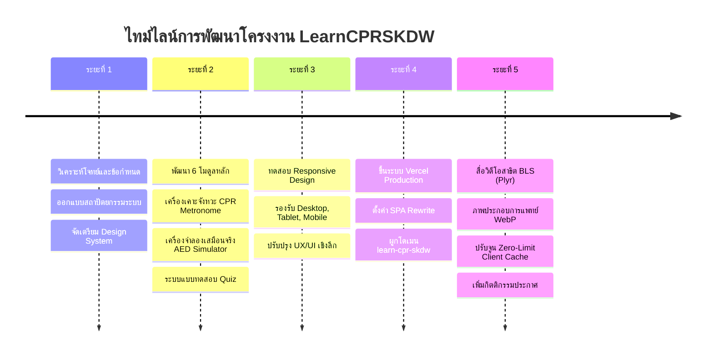

# บันทึกประวัติและขั้นตอนการพัฒนาเว็บไซต์ (Development History Log)
## โครงงานเว็บไซต์คู่มือกู้ชีพและปฐมพยาบาลฉุกเฉิน: LearnCPRSKDW

> **วิชาโครงงานการศึกษาค้นคว้าอิสระ**  
> **ระดับชั้น:** มัธยมศึกษาปีที่ 3/3 โรงเรียนสุคนธีรวิทย์  
> **ครูที่ปรึกษาโครงงาน:** คุณครูวิลัยวรรณ  
> **URL โครงงาน (Production):** [https://learn-cpr-skdw.vercel.app](https://learn-cpr-skdw.vercel.app)  
> **GitHub Repository:** [https://github.com/bpppoh/LearnCPRSKDW](https://github.com/bpppoh/LearnCPRSKDW)

---

## 👥 1. ข้อมูลคณะผู้จัดทำโครงงาน (Project Team)

| ลำดับ | ชื่อ - นามสกุล | ระดับชั้น | เลขที่ | สถานศึกษา |
| :---: | :--- | :---: | :---: | :--- |
| 1 | นาย กิตติพัฒน์ โตเลี้ยง | ชั้น ม.3/3 | เลขที่ 1 | โรงเรียนสุคนธีรวิทย์ |
| 2 | ด.ช. คุณานนท์ อุนทุโร | ชั้น ม.3/3 | เลขที่ 4 | โรงเรียนสุคนธีรวิทย์ |
| 3 | นาย ธนาธิป ตั้งศุภธวัช | ชั้น ม.3/3 | เลขที่ 7 | โรงเรียนสุคนธีรวิทย์ |
| 4 | ด.ญ. กัญญาพัชร ลือยาม | ชั้น ม.3/3 | เลขที่ 16 | โรงเรียนสุคนธีรวิทย์ |
| 5 | ด.ญ. ไอลดา พิณทอง | ชั้น ม.3/3 | เลขที่ 18 | โรงเรียนสุคนธีรวิทย์ |
| 6 | ด.ญ. นันท์นภัส แดงบุญมี | ชั้น ม.3/3 | เลขที่ 25 | โรงเรียนสุคนธีรวิทย์ |

---

## 🛠️ 2. เทคโนโลยีที่ใช้ในการพัฒนา (Technology Stack)

เว็บไซต์นี้ได้รับการออกแบบตามแนวทาง **100% Client-Side Architecture (Serverless & Database-Free)** เพื่อความรวดเร็ว ปลอดภัย และไม่พึ่งพาเซิร์ฟเวอร์หลังบ้าน:

- **Frontend Core:** React 19, TypeScript, Vite 8
- **Styling & Design System:** Tailwind CSS (กำหนดจานสีเฉพาะ: Rescue Orange `#ea580c`, `#f97316` และ Medical Blue `#0284c7`, `#0369a1`) ตามมาตรฐาน **21st.dev UI/UX Guidelines**
- **Component Patterns:** Bento Grid Layout, Radial Mouse-Tracking Spotlight Cards, Pill Navigation
- **Interactive Engines:**
  - **Web Audio API:** ใช้สร้างคลื่นเสียง Oscillator สำหรับเครื่องเคาะจังหวะกู้ชีพ (CPR Metronome 100–120 BPM) โดยไม่ต้องพึ่งไฟล์เสียง MP3 ภายนอก
  - **Virtual AED State Machine:** ระบบจำลองขั้นตอนเครื่อง AED 4 สเต็ปตามสถานการณ์จริง
  - **Canvas Confetti:** ระบบแสดงเอฟเฟกต์เฉลิมฉลองเมื่อทำแบบทดสอบผ่านเกณฑ์
  - **Plyr.io:** เครื่องเล่นวิดีโอระดับมาตรฐานสากล พร้อมการคุมธีมสี Rescue Orange และระบบ Interactive Timeline Jump
- **Hosting & CI/CD:** GitHub Repository ควบคุมเวอร์ชัน และ Deploy ผ่าน Vercel Edge Network อัตโนมัติ

---

## 📅 3. บันทึกไทม์ไลน์การพัฒนา (Chronological Development Milestones)

---

### ระยะที่ 1: การวางแผนและการกำหนดโครงสร้างระบบ (Inception & System Design)
- **การวิเคราะห์โจทย์:** กำหนดเป้าหมายให้เป็นคู่มือช่วยชีวิตฉุกเฉินที่นักเรียนและประชาชนทั่วไปสามารถเข้าถึงได้ทันทีโดยไม่ต้องโหลดแอป ไม่ต้องล็อกอิน และไม่มีโฆษณา
- **การเลือกสถาปัตยกรรม:** เลือกใช้ Client-Side Rendering (CSR) แบบ SPA เพื่อลดภาระเซิร์ฟเวอร์ ให้ความเร็วในการสลับหน้าแบบไร้รอยต่อ (Zero Latency)
- **การจัดตั้ง Repository:** ริเริ่มโปรเจกต์ด้วย Git และโครงสร้างโฟลเดอร์ที่เป็นระบบ (`src/components`, `src/pages`, `public/images`)

---

### ระยะที่ 2: การพัฒนาฟังก์ชันและโมดูลการเรียนรู้ (Core Feature Development)
1. **โมดูลการนำทาง (Navbar & Tab Controller):**
   - พัฒนาระบบสลับแท็บแบบ Smooth Transition เชื่อมต่อ 6 หน้าบทเรียน
   - เพิ่มปุ่มโทรด่วน `1669` (One-Click Emergency Dialing) ที่เข้าถึงได้ทันทีในทุกหน้า
2. **โมดูล CPR & เครื่องเคาะจังหวะ (CPR Beat Trainer):**
   - อธิบายหลักการกดหน้าอก Hands-Only CPR และอัตราส่วน 30:2
   - บรรจุตัวเลขสำคัญทางการแพทย์: ความลึก 5–6 ซม., ความเร็ว 100–120 ครั้ง/นาที, และการปล่อยคืนตัวสุด (Full Chest Recoil)
   - สร้างเครื่องเคาะจังหวะด้วย Web Audio API ที่สามารถปรับความเร็ว 100, 110, 120 BPM พร้อมระบบนับรอบกู้ชีพ 30 ครั้ง
3. **โมดูลประเมินผู้บาดเจ็บฉุกเฉิน (GRXABCDE Protocol):**
   - ถ่ายทอดหลักการประเมินการบาดเจ็บระดับสากลครบทั้ง 8 ขั้นตอน (General Impression, Response, eXsanguinating Hemorrhage, Airway, Breathing, Circulation, Disability, Exposure)
   - นำเสนอในรูปแบบแท็บโต้ตอบ และตารางสรุปเปรียบเทียบอาการและแนวทางแก้ไข
4. **โมดูลเครื่องกระตุกหัวใจไฟฟ้า (AED & Interactive Simulator):**
   - อธิบายกลไกคลื่นไฟฟ้าหัวใจที่ช็อกได้ (Shockable: VF/pVT) และช็อกไม่ได้ (Non-Shockable: Asystole/PEA)
   - พัฒนาโปรแกรมจำลอง **AED Virtual Simulator** ให้ผู้เรียนได้ทดลองกดทีละขั้นตอน:
     * *ขั้นตอนที่ 1:* เปิดเครื่อง (Power ON) และรับฟังเสียงแนะนำ
     * *ขั้นตอนที่ 2:* แปะแผ่นนำไฟฟ้า (ใต้ไหปลาร้าขวา และชายโครงซ้าย)
     * *ขั้นตอนที่ 3:* สั่งทุกคนถอยห้ามสัมผัสเพื่อวิเคราะห์คลื่นหัวใจ
     * *ขั้นตอนที่ 4:* กดปุ่มไฟกระพริบเพื่อปล่อยกระแสไฟฟ้าช็อก และทำ CPR ต่อเนื่อง
5. **โมดูลศูนย์รวมสายด่วนและวิธีรายงานเหตุ (Emergency Contacts):**
   - รวบรวมเบอร์ 1669, 191, 199, 1554, 1154, 1196 พร้อมปุ่มกดโทรออก และปุ่มคัดลอกเบอร์โทร (One-Click Copy)
   - จัดทำคู่มือ 5 ข้อมูลสำคัญที่ต้องแจ้งเมื่อโทร 1669 เพื่อให้ทีมกู้ชีพส่งรถพยาบาลได้รวดเร็วที่สุด
6. **โมดูลคณะผู้จัดทำและแบบทดสอบ (About Us & Mini-Quiz):**
   - แนะนำสมาชิกกลุ่มและครูที่ปรึกษาโครงงาน
   - บรรจุแบบทดสอบวัดความรู้ 5 ข้อ พร้อมระบบให้คะแนน คำอธิบายเฉลยละเอียด และ Confetti ฉลองความสำเร็จ

---

### ระยะที่ 3: การตรวจสอบ Responsive Design และประสบการณ์ผู้ใช้ (UI/UX Audit)
- ตรวจสอบการแสดงผลและทดสอบความเข้ากันได้แบบครอบคลุม:
  - **Mobile Viewport (375 × 667 px):** รองรับหน้าจอสมาร์ตโฟน, ปรับแต่ง Drawer Menu ให้เปิดปิดลื่นไหล, ขยายขนาดปุ่มแตะ (Touch Target) ให้กดง่ายไม่พลาด
  - **Tablet Viewport (768 × 1024 px):** จัดวางแบบ Grid 2 คอลัมน์ที่สมดุล
  - **Desktop Viewport (1280 × 800 px ขึ้นไป):** แสดงผล Bento Grid และลูกเล่น Spotlight Mouse-tracking สวยงามเต็มประสิทธิภาพ
- ปรับแต่ง Padding และ Margin ของ Navbar และ Footer ให้สวยงามลงตัวตามคำแนะนำของผู้ใช้งาน

---

### ระยะที่ 4: การนำระบบขึ้นสู่ Production บน Vercel (Deployment & DevOps)
- เชื่อมต่อ Git Remote กับ GitHub Repository: `https://github.com/bpppoh/LearnCPRSKDW.git`
- สร้างการตั้งค่า `vercel.json` เพื่อจัดการเส้นทางของ Single Page Application (Rewrite ทุก Route ไปยัง `/index.html`)
- กำหนดชื่อโปรเจกต์และเชื่อมต่อ Production Domain สากล: **`https://learn-cpr-skdw.vercel.app`**
- เปิดให้เข้าถึงแบบสาธารณะ (Public Access) รองรับการแชร์และเปิดบนทุกเบราว์เซอร์

---

### ระยะที่ 5: การยกระดับสื่อการสอนและการรีดประสิทธิภาพ (Media & Performance Optimization)
1. **การบูรณาการวิดีโอสาธิตภาคปฏิบัติ:**
   - นำวิดีโอสาธิตการช่วยฟื้นคืนชีพขั้นพื้นฐาน (BLS CPR) จาก **EDPYH Channel** มาสตรีมผ่านเครื่องเล่น **Plyr**
   - ออกแบบระบบ **Interactive Key Moments (Timeline Jump)** ให้นักเรียนคลิกข้ามไปยังหัวข้อสำคัญ เช่น ท่าทางการวางมือ หรือจังหวะการกดหน้าอกได้ทันทีในคลิกเดียว
2. **การเพิ่มภาพประกอบทางการแพทย์ระดับสากล:**
   - เพิ่มภาพถ่ายอุปกรณ์ **เครื่องกระตุกหัวใจไฟฟ้า AED** ครบชุดพร้อมแผ่นนำไฟฟ้า และจุดชี้บ่งส่วนประกอบ (Anatomy Badges)
   - เพิ่มภาพแผนผัง **ท่าทางการทำ CPR และตำแหน่งการวางมือที่ถูกต้อง** (Adult CPR Chest Compressions Technique)
3. **การโยนภาระโหลดไปยังฝั่ง Client เพื่อป้องกันการติดลิมิต Vercel (Zero-Limit Engineering):**
   - แปลงไฟล์ภาพทั้งหมดเป็นฟอร์แมต **WebP คุณภาพสูง** ส่งผลให้ภาพเครื่อง AED ลดขนาดจาก `561 KB` เหลือเพียง `53 KB` (ลดขนาดลงถึง 91%) และภาพ CPR มีขนาดเพียง `70 KB`
   - กำหนดค่า **Aggressive Client Caching** ใน `vercel.json`:
     `Cache-Control: public, max-age=31536000, immutable`
     ส่งผลให้เบราว์เซอร์ของผู้ชมเก็บไฟล์ไว้ในเครื่องตนเอง การเปิดดูซ้ำจะกินแบนด์วิดท์จาก Vercel เท่ากับ **0 KB**
   - กำหนดคุณสมบัติ **`loading="lazy"`** บนรูปภาพ เพื่อไม่ให้โหลดล่วงหน้าหากผู้ใช้ยังไม่ได้เปิดดูหน้านั้น
4. **การระบุกิตติกรรมประกาศและแหล่งอ้างอิงทางวิชาการ (Academic Integrity):**
   - เพิ่มเครดิตและลิงก์ต้นฉบับไปยังช่อง **EDPYH Channel** ใต้เครื่องเล่นวิดีโอ
   - บรรจุส่วน **"📚 แหล่งอ้างอิงทางวิชาการและกิตติกรรมประกาศสื่อ"** ไว้ใน Footer ท้ายเว็บไซต์อย่างชัดเจน อ้างอิงสถาบันการแพทย์ฉุกเฉินแห่งชาติ (สพฉ. 1669) และสมาคมแพทย์โรคหัวใจแห่งสหรัฐอเมริกา (American Heart Association - AHA)

---

## 📊 4. สรุปผลลัพธ์ของโครงงาน (Project Summary & Achievements)

| ตัวชี้วัด | ผลลัพธ์ที่ได้ |
| :--- | :--- |
| **สถาปัตยกรรมระบบ** | 100% Client-Side SPA (ไม่มี Database / ไม่มี Backend) |
| **ความเร็วในการโหลด (Load Time)** | น้อยกว่า 0.5 วินาที (Build Time: ~300-400 ms) |
| **ขนาดรวมของไฟล์หลัก (Gzipped)** | ประมาณ ~150 KB (เบามาก ประหยัดอินเทอร์เน็ต) |
| **อัตราการลดขนาดรูปภาพ (WebP Optimization)** | ประหยัดแบนด์วิดท์ลงกว่า 90% |
| **การรองรับอุปกรณ์ (Device Support)** | 100% Fully Responsive (Mobile, Tablet, Laptop, Desktop) |
| **ความถูกต้องทางวิชาการ** | อ้างอิงมาตรฐาน AHA Guidelines และ สพฉ. 1669 ครบถ้วน |
| **การเข้าถึงสาธารณะ (Public URL)** | [https://learn-cpr-skdw.vercel.app](https://learn-cpr-skdw.vercel.app) (สถานะ: ออนไลน์ 24 ชม.) |

---

*บันทึกข้อมูลและรวบรวมโดย: คณะผู้จัดทำโครงงาน ม.3/3 โรงเรียนสุคนธีรวิทย์*
